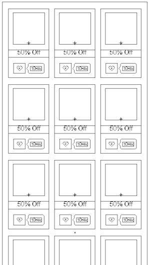
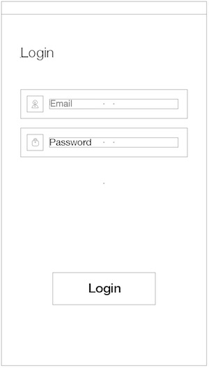

Coupons
=======

An Android application covers some of the basic use cases for the coupon 
product, BluePromoCode, and makes use of their RESTful API endpoints.

### Requirements ###

Your mission is to write an app with the following screens:

 

Use the [design](design) folder for guidance, we would like you to focus on how the app works more so than how it looks.

1. Coupons:
  - Show coupons from our REST API
  - Resource: `http://api.bluepromocode.com/v2/promotions`
  - Method: `GET`

2. Login:
  - Login using our REST API
  - Resource: `http://api.bluepromocode.com/v2/users/login`
  - Method: `POST`
  - JSON Encoded Parameters: `email`, `password`
  - We have a test account you can use: email: `a@a.com`, password: `12345678`

3. Bonus - Signup:
  - Signup using our REST API
  - Resource: `http://api.bluepromocode.com/v2/users/register`
  - Method: `POST`
  - JSON Encoded Parameters: `fullName`, `email`, `password`

4. Bonus - Personalized Coupons:
  - Show personalized coupons from our REST API (requires authentication)
  - Resource: `http://api.bluepromocode.com/v2/users/self/promotions/suggestions`
  - Method: `GET`

### Developing ###

This application is written Java with Eclipse, Android SKD.

### Running the code ###

1. Download this repository
2. Import the inner `Coupons` directory to Eclipse.
3. Right click the imported project, Choose `Run As`, then `1 Android Application`
4. Select Android Device
